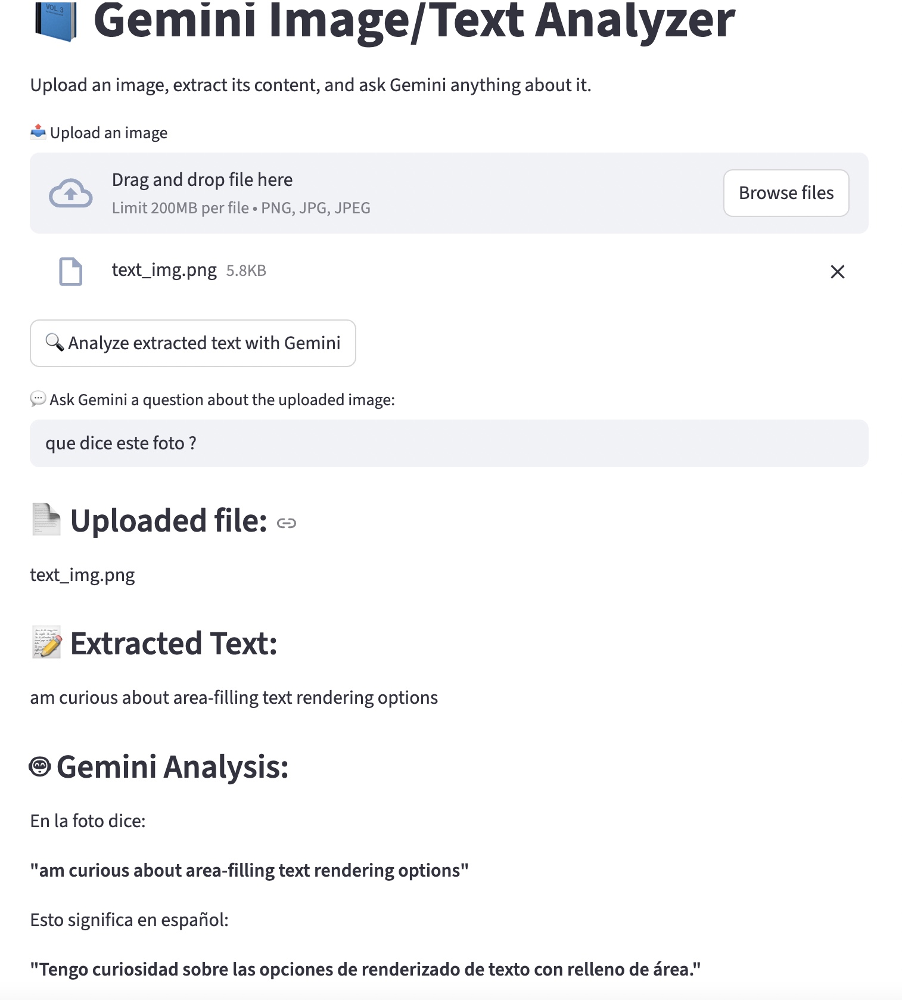

# 📘 Gemini Image/Text Analyzer

  

---

## Description

**Gemini Image/Text Analyzer** is a **Streamlit** app that allows you to:

- Upload images (PNG, JPG, JPEG) and PDFs  
- Automatically extract text using **OCR** (`easyocr`)  
- Automatically detect the language of the text  
- Ask questions and get answers from **Google Gemini AI**

Goal: provide an **interactive tool** for quickly analyzing visual and textual documents.

---

## 🚀 Features

1. **Upload images and PDFs**  
2. **OCR text extraction**  
3. **Automatic language detection**  
4. **Ask Gemini questions**: summarize text, highlight key points, answer your queries  
5. **Interactive Streamlit interface**

---

## 🖥️ Screenshot / GIF



## 🛠 Installation

1. **Clone the repository:**

```bash
git clone git@github.com:GeorgesSchmidt/GeminiStreamlit.git
cd gemini-analyzer
```

2. **Create a virtual environment and install dependencies :**

```bash
python -m venv .venv
source .venv/bin/activate   # macOS/Linux
# ou .venv\Scripts\activate pour Windows

pip install -r requirements.txt
```

3. **Set up your Google Gemini API key :**

Create a .env file in the root folder:

```bash
GOOGLE_API_KEY_Gem=ta_clef_api_google
```

## 🎚 Usage. 

```bash
streamlit run Web/mainStreamlit.py
```
- Upload an image or PDF. 
- Ask a question to Gemini or let the model automatically analyze the text. 

## ⏱ Unit tests. 

```bash
pytest -q --disable-warnings
```


